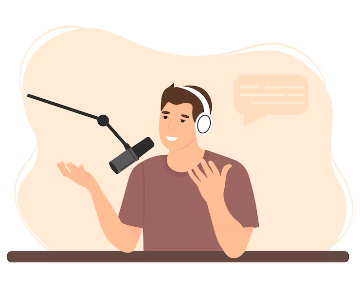

    <audio src="output/podcast_editado.MP3" controls title="Podcast editado"></audio>

# Projeto Podcast Gerado por I.A.s

Projeto com o objetivo de gerar um podcast utilizando ferramentas de IA através de prompts mais trabalhado.

## 💻 Tecnologias utilizadas no projeto

- [ChatGPT](https://chat.openai.com/) 
- [MidJourney](https://www.midjourney.com/app/)
- [ttsmaker](https://ttsmaker.com/br)
- [123APPS](https://online-video-cutter.com/)

## ✨ Como foi feito ?

- Roteiro gerado via chatgpt
- Audio gerado pela ttsmaker
- Midjourney Para gerar capas
- 123APPS para tratar aúdio e adicionar sons de fundo

## 📚 Materiais

- [Link da live no Youtube](https://www.youtube.com)
- [Notion Template](https://helpful-jump-17b.notion.site/PAS-Podcast-AI-Studio-210489e15d7a4a73b743bb159e45d06f?pvs=4)
- [Editor de aúdio](https://online-video-cutter.com/)

## 🛠️ Instruções de execução

Utilizado os prompts dentro do link do `Notion` fornecido na parte de `Materiais` para criar um podcast de maneira automatizada, para isso siga o passo a passo abaixo.

- 🤖 1. Use os prompts de roteiro no `chagpt`
- 🤖 2. Use os prompts de roteiro gerados pelo chatgpt no  `ttsmaker`
- 🤖 3. Use os prompts de artes no `midjourney`

⌨️ com 💜 por [Fernando de Sousa Fernandes](https://github.com/Fernandodesousafernandes)

https://github.com/Fernandodesousafernandes/PODCAST-BOOTCAMP-DIO-SANTANDER-2024.git

git@github.com:Fernandodesousafernandes/PODCAST-BOOTCAMP-DIO-SANTANDER-2024.git

https://github.com/Fernandodesousafernandes

https://www.notion.so/PAS-Podcast-AI-Studio-7b94a89e7e0e4cc29050abcc0f939a4c?p=f6730bbf63ce4f29bb7fb31bda34ac30&pm=c

https://www.notion.so/PAS-Podcast-AI-Studio-7b94a89e7e0e4cc29050abcc0f939a4c?p=abfe0abd67944e1d9fd92609b87c367f&pm=c
